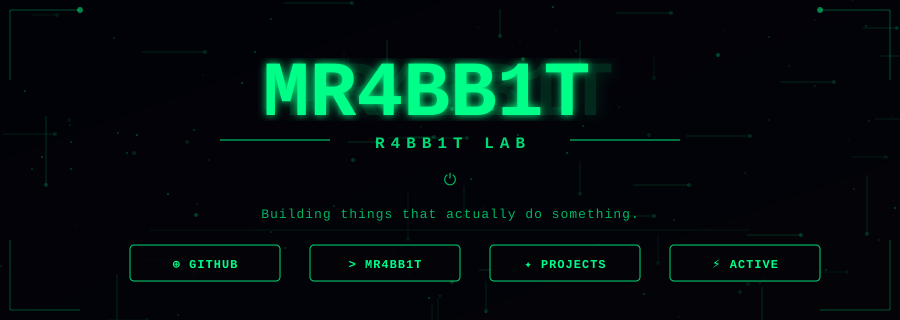
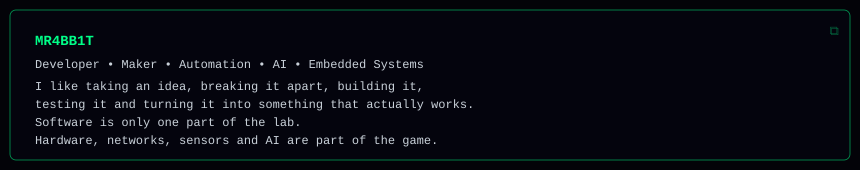
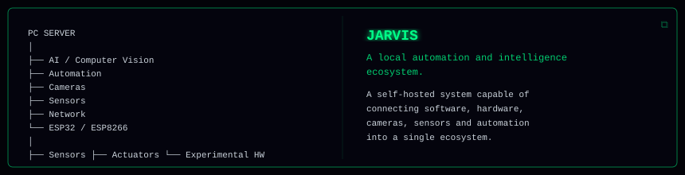
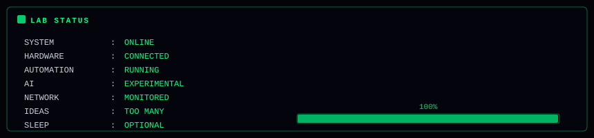

<div align="center">

<!-- BANNER PRINCIPAL -->


</div>

---

## `> whoami`



---

## `> currently_building`



---

## `> what_i_build`


---

## `> tech_stack`

### `LANGUAGES`


### `AI / COMPUTER VISION`


### `HARDWARE`


### `INFRASTRUCTURE`


---

## `> lab_status`



---

## `> github_stats`

<div align="center">


</div>

---

## `> contribution_activity`

<div align="center">


</div>

---

## `> philosophy`

```text
"Don't just use technology.

Understand it.
Break it.
Build it.
Improve it."
```

---

<div align="center">

### `MR4BB1T // DIGITAL LAB`

`BUILD • BREAK • LEARN • REBUILD`

<br>


</div>
