<div align="center">

<a href="https://github.com/Mr4bb1t">
  <picture>
    <source media="(prefers-color-scheme: dark)" srcset="./meteor_shower.svg">
    <source media="(prefers-color-scheme: light)" srcset="./meteor_shower.svg">
    
  </picture>
</a>


<br>

[](https://github.com/Mr4bb1t)
[](https://github.com/Mr4bb1t?tab=repositories)

</div>

---

## `> whoami`

```text
┌──────────────────────────────────────────────────────────────┐
│ MR4BB1T                                                      │
│                                                              │
│ Developer • Maker • Automation • AI • Embedded Systems       │
│                                                              │
│ I like taking an idea, breaking it apart, building it,       │
│ testing it and turning it into something that actually works.│
│                                                              │
│ Software is only one part of the lab.                        │
│ Hardware, networks, sensors and AI are part of the game.     │
└──────────────────────────────────────────────────────────────┘
```

---

## `> currently_building`

### `JARVIS`

> A local automation and intelligence ecosystem.

```text
PC SERVER
   │
   ├── AI / Computer Vision
   ├── Automation
   ├── Cameras
   ├── Sensors
   ├── Network
   └── ESP32 / ESP8266
            │
            ├── Sensors
            ├── Actuators
            ├── Automation
            └── Experimental Hardware
```

The goal is to build a self-hosted system capable of connecting software,
hardware, cameras, sensors and automation into a single ecosystem.

---

## `> what_i_build`

<table>
<tr>
<td width="50%">

### `01 — EMBEDDED`

ESP32 / ESP8266
Sensors & actuators
Displays
Wireless communication
Custom controllers
Experimental electronics

</td>

<td width="50%">

### `02 — AUTOMATION`

Self-hosted systems
Web automation
Bots
IoT
Home automation
Process automation

</td>
</tr>

<tr>
<td width="50%">

### `03 — AI`

Local AI
Computer Vision
MediaPipe
OpenCV
LLM experiments
AI-assisted systems

</td>

<td width="50%">

### `04 — NETWORKS`

Linux servers
Networking
Wi-Fi
Network analysis
VPN / infrastructure
Self-hosted services

</td>
</tr>
</table>

---

## `> tech_stack`

### `LANGUAGES`


### `AI / COMPUTER VISION`


### `HARDWARE`


### `INFRASTRUCTURE`


---

## `> projects`

<div align="center">

<a href="https://github.com/Mr4bb1t?tab=repositories">

</a>

</div>

> Explore the repositories to see the experiments, systems and prototypes currently living in the lab.

---

## `> github_stats`

<div align="center">


</div>

---

## `> contribution_activity`

<div align="center">


</div>

---

## `> lab_status`

```text
[████████████████████████████████████████] 100%

SYSTEM        : ONLINE
LAB           : ACTIVE
HARDWARE      : CONNECTED
AI            : EXPERIMENTAL
AUTOMATION    : RUNNING
NETWORK       : MONITORED
IDEAS         : TOO MANY
SLEEP         : OPTIONAL
```

---

## `> philosophy`

```text
"Don't just use technology.

Understand it.
Break it.
Build it.
Improve it."
```

---

<div align="center">

### `MR4BB1T // DIGITAL LAB`

`BUILD • BREAK • LEARN • REBUILD`

<br>


</div>
